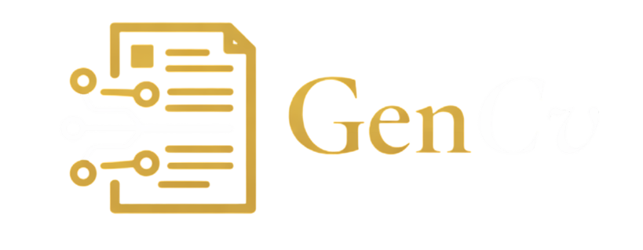

# GenCv - CV Builder
<p align="center">
  
</p>

GenCv is a web application built mainly to easily create and update a Curriculum Vitae (CV) directly in the browser.

## Features

- **AI Chat Assistant**: Chat interface for content editing and suggestions.
- **AI-Optimized Data Import**: Supports importing data from PDF files or raw text strings.
- **Templates**: Multiple layout options for CV generation.
- **PDF Export**: Generates PDF files on the client side via `jsPDF`.

### Local Development
To use AI components locally, the [Netlify CLI](https://docs.netlify.com/cli/get-started/) is required:

1. **Clone the repository**:
   ```bash
   git clone https://github.com/byseif21/GenCV.git
   ```
2. **Install dependencies**:
   ```bash
   npm install -g netlify-cli
   ```
3. **Start the server**:
   ```bash
   netlify dev
   ```
4. **Configuration**: Copy [.env.example](.env.example) to `.env` and add your API key.

## Development

### Adding Templates
1. Create a new JavaScript file in the [templates/](templates/) directory (e.g., `templates/style-name.js`).
2. Define the template object with `id`, `name`, and a `render(doc, data)` function.
3. Import the template in [js/templates/index.js](js/templates/index.js) and add it to the `cvTemplates` object.
4. Use the helper functions in [js/templates/utils.js](js/templates/utils.js) for layout and text wrapping.
5. Refer to the [templates/README.md](templates/README.md) for detailed technical instructions and AI-assisted rendering tips.

## Project Structure

- **[js/script.js](js/script.js)**: Main application logic, including data management, UI rendering, and AI integration.
- **[css/style.css](css/style.css)**: Project styling, organized by layout, components, and animations.
- **[templates/](templates/)**: CV template definitions and the [template README](templates/README.md).
- **[netlify/functions/](netlify/functions/)**: Serverless functions, including the AI proxy for secure API communication.

## Technologies

- **Frontend**: HTML, CSS, JavaScript (ES6 Modules)
- **Backend**: Netlify Functions (Node.js)
- **PDF**: jsPDF, pdf.js

## License

MIT License. See [LICENSE](LICENSE) for details.
